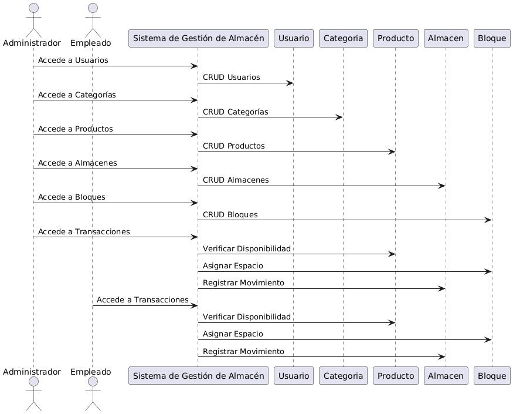
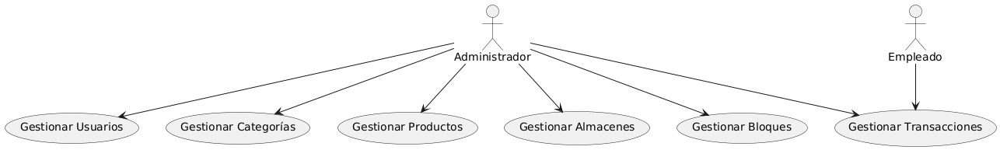
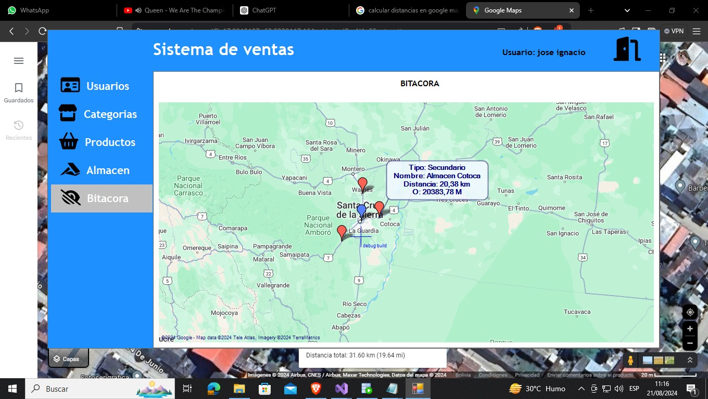

# Proyecto de Sistema de Información 3
## ALMAC - Control de Almacenes
## Fecha de Inicio: 09.08.2024
## Fecha de Finalizacion Estimada: 31.08.2024
## Universida Privada Domingo Savio
- `Pagina de Facebook de la universidad`: 
Puedes acceder al siguiente enlace para ingresar a la página de facebook de nuestra Universidad <a href="https://www.facebook.com/UPDS.bo">UPDS.com</a>.

## Docente: ING. Zambrana Chacon Jaime
- `Pagina de Facebook del Docente`: 
Puedes acceder al siguiente enlace para ingresar a la página de facebook de nuestro docente <a href="https://www.facebook.com/zambranachaconjaime">Jaime Sambrana.com</a>.

## Miembros del Equipo
1.	Jose Ignacio Burgos Ayala
2.	Lider Moreno Padilla 
3.	Diana Estefany Castaño Rodas
4.	Mauricio Alexander Flores Morales

## Roles
En el desarrollo de este proyecto, se asignaron los siguientes roles basados en el patrón Modelo-Vista-Controlador (MVC):

1. Team development: Jose Ignacio Burgos Ayala
2. Product owner:Lider Moreno Padilla 
3. Team development: Diana Estefany Castaño Rodas
4. Scrum master: Mauricio Alexander Flores Morales

## Contacto
¿Tienes preguntas, sugerencias o comentarios sobre el proyecto para "ALMAC"? No dudes en contactarnos:

- Jose Ignacio Burgos Ayala 
 Correo Electrónico: <a href="mailto:sc.jose.burgos.a@upds.net.bo">Hacer clic aquí para redactar un correo a Jose Ignacio</a>

- Lider Moreno Padilla:  
 Correo Electrónico: <a href="mailto:sc.lider.moreno.p@upds.net.bo">Hacer clic aquí para redactar un correo a Lider Moreno</a>

- Diana Estefany Castaño Rodas:
 Correo Electrónico: <a href="mailto:sc.diana.castano.r@upds.net.bo">Hacer clic aquí para redactar un correo a Diana Castaño</a>

- Mauricio Alexander Flores Morales:
Correo Electrónico: <a href="mailto:sc.mauricio.flores.m@upds.net.bo">Hacer clic aquí para redactar un correo a Mauricio Flores</a>

# Redes Sociales del equipo:

- `Facebook de Lider Moreno Padilla:` <a href="https://www.facebook.com/lider.morenopadilla.79?mibextid=b06tZ0">LiderMorenoPadilla.com</a>.

¡Bienvenido al repositorio del proyecto "ALMAC - Sistema de Información 3" 

- `Facebook de Jose Ignacio Burgos Ayala:` <a href="https://www.facebook.com/profile.php?id=100086019207901&mibextid=ZbWKwL">JoseIgnacioBurgos.com</a>.

¡Bienvenido al repositorio del proyecto "ALMAC - Sistema de Información 3" 

- `Facebook de Diana Estefany Castaño Rodas:` <a href="https://www.facebook.com/profile.php?id=100009750429193&mibextid=ZbWKwL">DianaRodas.com</a>.

¡Bienvenido al repositorio del proyecto "ALMAC - Sistema de Información 3" 

- `Facebook de Mauricio Alexander Flores Morales:` <a href="https://www.facebook.com/mauricioalexander.floresmorales.9?mibextid=LQQJ4d
">MauricioFlores.com</a>.

¡Bienvenido al repositorio del proyecto "ALMAC - Sistema de Información 3" 

## Fase 1: Identificación y recolección de requisitos

## Descripción
ALMAC ha creado un sistema integral de gestión de inventarios y logística usando C# con interfaz gráfica Windows Forms y arquitectura en capas. Conectado a una base de datos Oracle, el sistema ofrece funcionalidades como administración de productos, registros de clientes, generación de reportes, control de ubicaciones y seguimiento de personal y clientes mediante dashboards. Este programa mejora la eficiencia operativa y la satisfacción del cliente al resolver problemas de inventarios, distribución y administración logística.

## Area de enfoque 
Creación y desarrollo de un sistema de gestión de inventarios y logística para ALMAC.

## Problema especifico a resollver 
El problema específico a resolver es el manejo ineficiente de inventarios y la gestión logística en los almacenes de ALMAC, lo cual ha generado inconvenientes como discrepancias entre el inventario registrado y el real, demoras en la distribución de productos, y creciente insatisfacción de los clientes debido a errores en las entregas y productos fuera de stock.

## Requisitos recopilados:

## Requisitos Funcionales

Sistema de Autenticación

Login Seguro: Implementar una pantalla de inicio de sesión para administradores registrados, utilizando autenticación mediante usuario y contraseña.
Acceso Restringido: Solo los administradores registrados deben poder acceder al sistema.
Gestión de Inventario

Registro de Productos: Permitir el registro de productos por categoría con atributos específicos.
Atributos de Productos: Incluir categoría, nombre, descripción, código y cantidad por caja (1200 unidades por caja).
Distribución y Almacenamiento

Distribución en Bloques: Gestionar el inventario distribuido en 5 bloques de almacenamiento, cada uno con capacidad de 600 cajas, para un total de 3000 cajas.
Registro de Movimientos

Entradas y Salidas de Productos: Registrar detalladamente las entradas y salidas de productos, incluyendo el nombre del conductor, placa del vehículo, hora y fecha, y tipo de movimiento (venta o transferencia).
Tipos de Movimientos: Registrar entradas de productos, salidas para venta y movimientos a otro almacén.
Reportes y Control

Generación de Reportes: Generar reportes periódicos sobre el inventario y los movimientos de productos.
Control y Monitoreo: Monitorear en tiempo real la disponibilidad de productos por bloque, con alertas de baja disponibilidad o exceso de stock.
Interfaz de Usuario

Interfaz Intuitiva: Proporcionar un panel de control con vista general del inventario y movimientos, además de funciones de búsqueda, filtrado de productos, y exportación de datos a formatos como CSV, Excel, y PDF.
Identificador Único de Almacén

Crear un identificador único para cada almacén que permita rastrear y gestionar la entrada y salida de productos entre almacenes de acuerdo con los bloques establecidos.
Rol o Usuario Específico

Crear un rol o usuario específico para cada almacén con permisos limitados a la administración de ese almacén, asegurando que solo puedan visualizar y manejar datos relacionados con su almacén asignado.

## Requisitos No Funcionales

Seguridad

Seguridad de Datos: Implementar encriptación de datos sensibles y configurar copias de seguridad automáticas y periódicas para proteger la información del sistema.
Escalabilidad

Escalabilidad del Sistema: Diseñar el sistema con la capacidad de gestionar más bloques o productos adicionales en el futuro y adaptarse a cambios en los procesos de almacenamiento y distribución.
Interfaz de Usuario

Usabilidad: La interfaz debe ser intuitiva y fácil de usar, permitiendo una navegación sencilla y eficiente para los administradores del sistema.

## Fase 2: Selección de Metodologia y diseño del sistema

## Metodología de desarrollo seleccionada:

La metodología que se utilizó para el desarrollo de este proyecto fué la SCRUM

## Justificación de la selección:

La metodología Scrum ofrece una estructura ágil y colaborativa que permite adaptarse a cambios, entregar funcionalidades clave de manera incremental, y mejorar continuamente, lo que la convierte en la elección ideal para el desarrollo del sistema de gestión de inventarios y logística de ALMAC.

## Arquitectura del sistema

### Diagrama de Clases:
  

### Diagrama de Secuencia:
  

### Caso de uso :
  

### Login:

Para entrar se necesita un usuario y una contraseña

  

### Interfaz Principal
 

### Interfaz Productos:

Aqui se agregaran los productos de ALMAC

### Interfaz Categoria:

En está sección podremos categorizar nuestros productos

### Bitacora: 

Rutas de distribución 

## Contenido

- `Cronograma`: 
Para obtener detalles adicionales sobre nuestro cronograma puedes acceder al siguiente enlace <a href="https://www.notion.so/5ffc272d2f4843d4b80c9ca86d771285?v=ecf808ce22f04ab291b05a4f26520206&pvs=4">CRONOGRAMA.com</a>.

- `Ingresa a Nuestra Presentación:`: 
Ingresa al enlace para ver más detalles en nuestra presentación digital: <a href="https://www.canva.com/design/DAGNjMyvFaM/AJ8pb1X0192KMrZ7PSx_nw/view?utm_content=DAGNjMyvFaM&utm_campaign=designshare&utm_medium=link&utm_source=editor">PRESENTACIÓN.com</a>.

- `Ingresa a Nuestra Documentación:`:
Ingrese al enlace para saber mas de nuestro probrama para control de almacenes ALMAC: <a href="">Documentacion.com</a>.

## Notas
- Este proyecto es parte de un trabajo académico para la materia de Sistema de Información III.

¡Gracias por tu interés en el proyecto "ALMAC"!

 
