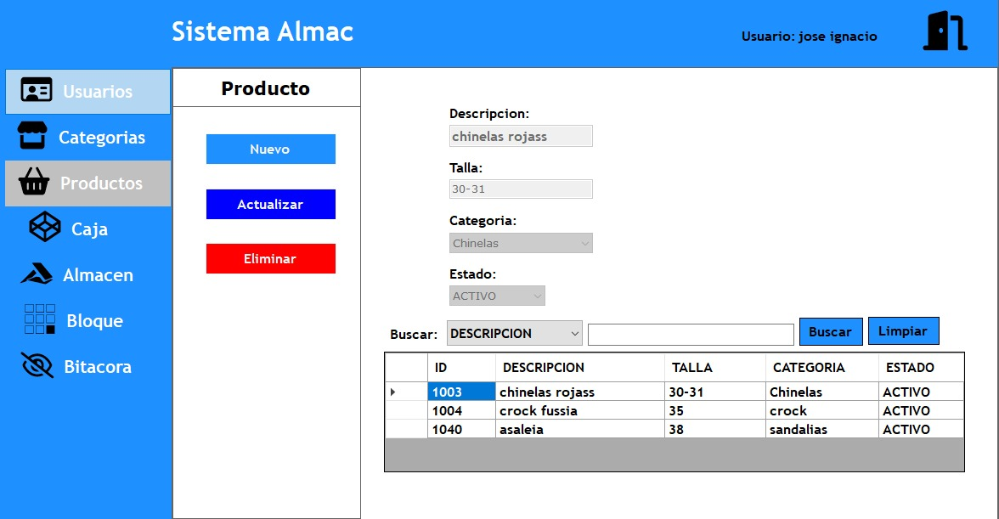

# Proyecto de Sistema de Información 3
## ALMAC - Control de Almacenes
## Fecha de Inicio: 09.08.2024
## Fecha de Finalizacion Estimada: 31.08.2024
## Universida Privada Domingo Savio
- `Pagina de Facebook de la universidad`: 
Puedes acceder al siguiente enlace para ingresar a la página de facebook de nuestra Universidad <a href="https://www.facebook.com/UPDS.bo">UPDS.com</a>.

## Docente: ING. Zambrana Chacon Jaime
- `Pagina de Facebook del Docente`: 
Puedes acceder al siguiente enlace para ingresar a la página de facebook de nuestro docente <a href="https://www.facebook.com/zambranachaconjaime">Jaime Sambrana.com</a>.

## Miembros del Equipo
1.	Jose Ignacio Burgos Ayala
2.	Lider Moreno Padilla 
3.	Diana Estefany Castaño Rodas
4.	Mauricio Alexander Flores Morales

## Roles
En el desarrollo de este proyecto, se asignaron los siguientes roles basados en el patrón Modelo-Vista-Controlador (MVC):

1. Team development: Jose Ignacio Burgos Ayala
2. Product owner:Lider Moreno Padilla 
3. Team development: Diana Estefany Castaño Rodas
4. Scrum master: Mauricio Alexander Flores Morales

## Contacto
¿Tienes preguntas, sugerencias o comentarios sobre el proyecto para "ALMAC"? No dudes en contactarnos:

- Jose Ignacio Burgos Ayala 
 Correo Electrónico: <a href="mailto:sc.jose.burgos.a@upds.net.bo">Hacer clic aquí para redactar un correo a Jose Ignacio</a>

- Lider Moreno Padilla:  
 Correo Electrónico: <a href="mailto:sc.lider.moreno.p@upds.net.bo">Hacer clic aquí para redactar un correo a Lider Moreno</a>

- Diana Estefany Castaño Rodas:
 Correo Electrónico: <a href="mailto:sc.diana.castano.r@upds.net.bo">Hacer clic aquí para redactar un correo a Diana Castaño</a>

- Mauricio Alexander Flores Morales:
Correo Electrónico: <a href="mailto:sc.mauricio.flores.m@upds.net.bo">Hacer clic aquí para redactar un correo a Mauricio Flores</a>

# Redes Sociales del equipo:

- `Facebook de Lider Moreno Padilla:` <a href="https://www.facebook.com/lider.morenopadilla.79?mibextid=b06tZ0">LiderMorenoPadilla.com</a>.

¡Bienvenido al repositorio del proyecto "ALMAC - Sistema de Información 3" 

- `Facebook de Jose Ignacio Burgos Ayala:` <a href="https://www.facebook.com/profile.php?id=100086019207901&mibextid=ZbWKwL">JoseIgnacioBurgos.com</a>.

¡Bienvenido al repositorio del proyecto "ALMAC - Sistema de Información 3" 

- `Facebook de Diana Estefany Castaño Rodas:` <a href="https://www.facebook.com/profile.php?id=100009750429193&mibextid=ZbWKwL">DianaRodas.com</a>.

¡Bienvenido al repositorio del proyecto "ALMAC - Sistema de Información 3" 

- `Facebook de Mauricio Alexander Flores Morales:` <a href="https://www.facebook.com/mauricioalexander.floresmorales.9?mibextid=LQQJ4d
">MauricioFlores.com</a>.

¡Bienvenido al repositorio del proyecto "ALMAC - Sistema de Información 3" 

## Descripción
ALMAC ha creado un sistema integral de gestión de inventarios y logística usando C# con interfaz gráfica Windows Forms y arquitectura en capas. Conectado a una base de datos Oracle, el sistema ofrece funcionalidades como administración de productos, registros de clientes, generación de reportes, control de ubicaciones y seguimiento de personal y clientes mediante dashboards. Este programa mejora la eficiencia operativa y la satisfacción del cliente al resolver problemas de inventarios, distribución y administración logística.

## Contenido del Avance

Diagrama de la Base de Datos (ALMAC CONTROL DE ALMACENES) :

### Diagrama de nuestra base de datos:
  

### Login:

Para entrar se necesita un usuario y una contraseña

   

### Interfaz Principal
 

### Usuario: 

Habra una ventana donde estaran los datos personales del usuario que haya ingresado   

El Administrador tendra acceso a hacer todo tipo de modificaciones con respecto a la interfaz de usarios 

Mientras que el empleado no tendra acceso y no podra ver esta interfaz

### Interfaz Productos:

Aqui se agregaran los productos de ALMAC

### Interfaz Categoria:

En está sección podremos categorizar nuestros productos

## Contenido

- `Cronograma`: 
Para obtener detalles adicionales sobre nuestro cronograma puedes acceder al siguiente enlace <a href="https://www.notion.so/5ffc272d2f4843d4b80c9ca86d771285?v=ecf808ce22f04ab291b05a4f26520206&pvs=4">CRONOGRAMA.com</a>.

- `Ingresa a Nuestra Presentación:`: 
Ingresa al enlace para ver más detalles en nuestra presentación digital: <a href="https://www.canva.com/design/DAGNjMyvFaM/AJ8pb1X0192KMrZ7PSx_nw/view?utm_content=DAGNjMyvFaM&utm_campaign=designshare&utm_medium=link&utm_source=editor">PRESENTACIÓN.com</a>.

- `Ingresa a Nuestra Documentación:`:
Ingrese al enlace para saber mas de nuestro probrama para control de almacenes ALMAC: <a href="">Documentacion.com</a>.

## Notas
- Este proyecto es parte de un trabajo académico para la materia de Sistema de Información III.

¡Gracias por tu interés en el proyecto "ALMAC"!

 
